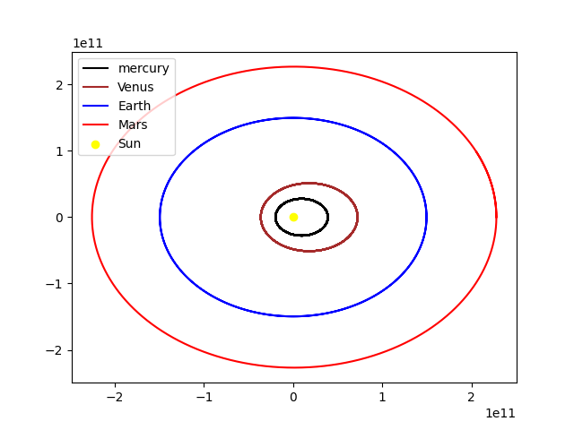

# Planetary Orbit Simulation Using Python

## Overview
This project simulates the motion of celestial bodies using Python, leveraging Newton's law of gravitation and classical mechanics. It allows both predefined simulations of the Solar System and custom simulations with user-defined parameters.

##Project Demo
[Link to the Demo Video](https://drive.google.com/file/d/1NMEw8fjO0sofOzShXkhjQyhIL4ucGKhl/view?usp=sharing)

## Features
1. **Predefined Simulation**: Models Mercury, Venus, Earth, Mars, and the Sun over two Earth years.
2. **Custom Simulation**: Enables users to define their own celestial system by specifying mass, position, and velocity of bodies.
3. **Visualization**: Displays the trajectories of bodies in 2D space.

## How It Works
### Core Principles
- **Gravitational Force**:
  $$F = \frac{G \cdot m_1 \cdot m_2}{r^2}$$
  where:
  - $G$ is the gravitational constant,
  - $m_1, m_2$ are masses, and
  - $r$ is the distance between the bodies.

- **Motion Update**:
  - Velocity:
    $$v = v + a \cdot \Delta t$$
  - Position:
    $$x = x + v \cdot \Delta t$$

### Implementation Highlights
- **Class `Body`**: Represents celestial bodies with attributes for mass, position, velocity, and force.
- **Simulation**: Uses iterative time-stepping to calculate positions and velocities.
- **Visualization**: Plots the orbital paths using Matplotlib.

## Usage Instructions
1. **Run the Script**:
   Execute the script in Python.
2. **Choose Simulation Mode**:
   - Enter `1` for predefined simulation (Solar System).
   - Enter `2` for custom simulation.
3. **Provide Parameters** (if custom simulation is selected):
   - Mass, position, and velocity for the orbiting body.
   - Duration for the simulation.
4. **View the Plot**:
   - The script will generate a graphical representation of the trajectories.

## Applications
- Educational tool for astrophysics and orbital mechanics.
- Platform for testing celestial motion hypotheses.
- Visualization tool for gravitational interactions.

## Examples
### Predefined Simulation

### Custom Simulation

## Future Enhancements
- Add more celestial bodies to simulations.
- Extend to 3D simulations.
- Include perturbation effects for enhanced realism.
- Optimize for large-scale systems.

## Conclusion
This project demonstrates the power of Python in simulating and visualizing celestial mechanics. With its modular design, it provides a flexible platform for both educational and scientific exploration.
